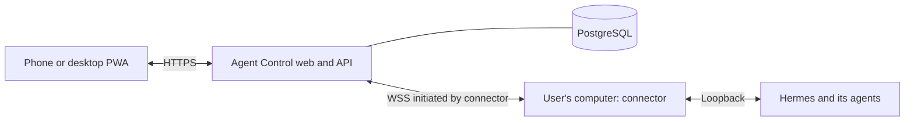

# Agent Control

Agent Control is a mobile-first web app for using your own Hermes agents from
any device. The [public beta](https://agentcontrol.jemailabs.com) uses Google
sign-in by invitation and a personal connector on each computer running Hermes.
**No Tailscale, public IP, inbound port forwarding or SSH tunnel is required on
the user's computer or phone.** The connector opens an outbound HTTPS/WSS
connection to Agent Control.

You can install Agent Control with a bundled Hermes runtime or connect a
compatible Hermes installation you already use. Your agents run on your own
computers, and Hermes remains the source of truth for profiles, conversations,
files and cron jobs. The Mac application handles setup and maintenance;
conversations happen in the React PWA on mobile or desktop.

<p align="center">
  
</p>

For agent operations, the PWA uses same-origin APIs and normalized realtime
events. In cloud mode, Hermes dashboard credentials and inference-provider
credentials remain on the user's computer. The cloud coordinates accounts and
connections and processes conversations and files in transit; this is not
end-to-end encryption. Optional PWA voice integrations have their own settings
and credential handling.

## Get started with the public beta

1. Open [Agent Control](https://agentcontrol.jemailabs.com) and sign in with an
   invited Google account.
2. Open **My computers → Connect a computer** and choose an installation path:

   | Option | Platforms | What it installs |
   | --- | --- | --- |
   | **Install Agent Control with Hermes** | macOS 13+ on Apple Silicon; Linux x86_64 or ARM64 with systemd | A guided installer with a pinned Hermes runtime, bundled Python, dependencies and the connector. No Python, Node, Git or compiler setup is needed. |
   | **Connect my existing Hermes** | Linux and macOS, Intel or ARM | Only the connector, with its runtime included. Your compatible Hermes installation, configuration and data stay in place. |

3. For a new managed installation, configure the AI provider in the local
   wizard: ChatGPT device-code sign-in, OpenRouter, or an OpenAI, Anthropic or
   Gemini API key. Google identifies your Agent Control account; your AI
   provider supplies the models and applies its own limits and charges. PWA
   dictation and voice require their separate configuration.
4. Open the link shown by the installer, review the temporary code, and confirm
   the computer and the profiles you want to share.
5. Once the computer is connected and its profiles are ready, open a chat.
   Keep that computer on and connected while using its agents. Sleeping or
   disconnected computers appear offline.

### Install Agent Control with Hermes

**Mac:** download the signed and notarized DMG from the
[connection page](https://agentcontrol.jemailabs.com/connect), copy **Agent
Control.app** to your user's `~/Applications` folder, and open it. The wizard
guides provider setup, pairing and any macOS background-service approval.

**Linux:** run this command on the computer where the agents will run:

```sh
curl --proto '=https' --tlsv1.2 -fsSL https://agentcontrol.jemailabs.com/downloads/agent-control/install.sh | sh -s -- --server https://agentcontrol.jemailabs.com
```

The Linux targets are Ubuntu 22.04/24.04 and Debian 12/13, with a working systemd
user session, curl, OpenSSL, tar and standard shell utilities. On an SSH server,
the wizard checks whether its user service can keep running after logout and
explains any administrator action needed. See
[managed installation](docs/operations/managed-installation.md) for supported
targets, data locations, maintenance and the remaining clean-machine acceptance
checks.

Managed installation uses a separate Hermes home and signed, versioned runtime
files. Existing Hermes installations are detected and can be reused when
compatible. Updates are explicit and refuse to interrupt active or uncertain
work. Uninstall preserves user data by default.

### Connect existing Hermes

Start a compatible, authenticated Hermes dashboard on loopback, then run:

```sh
curl --proto '=https' --tlsv1.2 -fsSL https://agentcontrol.jemailabs.com/downloads/connector/install.sh | sh -s -- --server https://agentcontrol.jemailabs.com
```

The connector detects an audited Hermes revision and looks for its local
dashboard token; if needed, it asks for that token without echoing it. It does
not install or start Hermes. See the
[connector runbook](docs/operations/cloud.md#signed-connector-downloads) for
custom paths, diagnostics and token discovery.

The pairing screen lists technical profile names. An agent's personal identity
can belong to `default`, so select that profile when sharing the default agent.
After connecting, Agent Control synchronizes the profiles and their display names.

### Revoke or reconnect a computer

Revoke access from **My computers**. Its agents, conversations and automations
leave the active lists and search; the previous computer entry stays marked
**Revoked**. Existing metadata is retained and revocation never deletes Hermes
data. A computer that is merely offline remains visible.

For a standalone connector, repeat the existing-Hermes command and answer `y`
to **Reconnect this computer? [y/N]**, then approve the new code in the web app.
Without an interactive terminal, add `--reconnect` to request that flow
explicitly; browser approval is still required. The installer preserves the
local Hermes configuration and data, and issues a new pairing credential.

Only the new connection's profiles appear in the active agent list. Computers
are not merged by hostname or agent name, and Control-only organization attached
to the revoked identity is not reassigned automatically. Managed installations
use their own application or setup wizard rather than the standalone reconnect
command.

### Install the PWA on your phone or desktop

Open the public HTTPS site and use the installation invitation when supported
by your browser. On iPhone or iPad, open it in Safari and choose **Share → Add
to Home Screen**. Enable notification permission separately if you want
completion alerts. You do not need Tailscale or a terminal on the phone.

## Highlights

| Area | Available today |
| --- | --- |
| Conversations | Open any sidebar conversation directly from another screen; create and resume profile-isolated chats, attach images or supported files, stream Markdown, stop a run, answer verified approvals and clarifications, recover after disconnects, export or archive a conversation, and play proxied voice notes. |
| Computers and agents | Pair personal computers, select the Hermes profiles to share, discover their agents and use verified chat and administration capabilities. Revoked connections disappear from active lists, so re-pairing does not leave obsolete agent cards. |
| Automations | Create, edit, pause, resume, run and delete cron jobs on eligible profiles; use simple or advanced schedules; inspect the next five runs; filter results by All, Unread and Read. |
| Voice | Configure one owner-scoped ElevenLabs key for Scribe v2 Realtime dictation and response playback with either Flash v2.5 or Multilingual v2. Choose an account voice and model, listen while an answer streams, or replay any completed response with play/pause, stop and speed controls. Eleven v3 is intentionally excluded; native keyboard dictation remains the free fallback. |
| Organization | Group chats into optional local workspaces, pin important conversations, open the ten most recent chats from a notification inbox with durable unread state, search across the interface and keep an encrypted, bounded offline snapshot when explicitly enabled. |
| Mobile and desktop | Installable PWA with opt-in Web Push completion alerts, 44 px touch targets, bottom navigation and context sheets on mobile, two panels on tablet, three panels on desktop, and dark/light/automatic themes. |
| Internationalization | English, Spanish, French, German and Portuguese with browser-language detection and an immediate device-only language preference. |
| Installation | Signed connector packages for Linux/macOS on Intel and ARM; a managed Hermes installer for Linux and a signed, notarized DMG for Apple Silicon Macs. Explicit updates, diagnostics, rollback and data-preserving uninstall. |
| Operations | Isolated cloud deployment with PostgreSQL, Google invitations, immutable releases, idle-work checks, verified backups and public health/readiness/PWA checks. Private SQLite deployments and optional SSH/Tailscale workflows remain supported. |

<table>
  <tr>
    <td width="33%" align="center">
      <br>
      <strong>Conversation-first mobile UI</strong>
    </td>
    <td width="33%" align="center">
      <br>
      <strong>Readable automation inbox</strong>
    </td>
    <td width="33%" align="center">
      <br>
      <strong>Agent creation without a terminal</strong>
    </td>
  </tr>
</table>

## Documentation

- [Public cloud beta](docs/operations/cloud.md): invitation-only Google login,
  personal Linux/macOS connectors, signed downloads and isolated cloud deployment.
- [Managed Hermes installation](docs/operations/managed-installation.md): Mac
  DMG, guided Linux setup, provider authentication, local data and maintenance.
- [Managed distribution](deploy/managed/README.md): pinned runtime builds,
  manifests, signing, notarization and release acceptance.
- [User guide](docs/user-guide.md): concepts, everyday workflows, mobile use,
  dictation, spoken responses, language settings and troubleshooting.
- [Architecture](docs/architecture.md): trust boundaries, provider adapters,
  session identity, recovery and BYOK dictation.
- [Private deployment runbook](docs/operations/deployment.md): systemd, Docker,
  optional Tailscale Serve and post-deploy checks for the private installation.
- [Private local installers](docs/operations/installers.md): full systemd and per-user
  macOS setup, including dry runs, prerequisites, flags, secrets, and recovery.
- [Development runbook](docs/operations/development.md): mock and remote-tunnel
  workflows.
- [Threat model](docs/threat-model.md), [known limitations](docs/limitations.md)
  and [remote test safety](docs/operations/remote-test-safety.md).

## Local development

These requirements are for contributors running the source checkout, not for
users of the packaged installers: Node 20+, npm and Python `>=3.12,<3.15`.

```bash
cp .env.example .env
make bootstrap
make migrate
```

Generate a development vault key without committing it:

```bash
python3 -c 'import base64,secrets; print(base64.urlsafe_b64encode(secrets.token_bytes(32)).decode().rstrip("="))'
```

Set that output as `HERMES_CONTROL_VAULT_KEY_B64` in `.env`. Start the
deterministic mock for local development without an external Hermes installation:

```bash
make mock
```

For the optional private remote-development workflow, use the configured SSH
tunnel supervisor instead:

```bash
make tunnels
```

This developer workflow is separate from the public connector and does not
make SSH or Tailscale a requirement for cloud users.

Then start the API and web app in separate terminals:

```bash
make api
make dev
```

The Vite app uses same-origin `/api` and `/realtime` paths through its
development proxy. No Hermes or ElevenLabs secret is needed by the frontend.

Create the first administrator with the backend CLI after the migration:

```bash
.venv/bin/hermes-control-admin create-admin --username admin
```

`make api` also depends on the idempotent Alembic migration target, so every
development API start verifies the schema before serving requests.

## Verification

```bash
make test
make build
```

Remote integration tests are opt-in. Agent capabilities depend on the verified
Hermes contract and the deployment's access policy. Automated destructive test
mutations remain hard-guarded to the designated `control-dev` test profile; they
must not run against a user's other profiles. See
[remote test safety](docs/operations/remote-test-safety.md).

## Repository map

- `apps/web`: production React 19 PWA.
- `apps/api`: FastAPI backend and security boundary.
- `apps/mock-hermes`: deterministic Hermes protocol simulator.
- `packages/hermes-client`: typed defensive Hermes clients and session routing.
- `packages/connector`: personal connector, shared setup engine and managed
  installation lifecycle.
- `packages/ui`: shared presentation primitives.
- `design/prototypes/mobile-option-2`: selected mobile prototype and visual QA.
- `docs`: user guide, architecture, API matrix, threat model, ADRs and operations.
- `deploy/cloud`: cloud deployment, backup, migration rehearsal and verification.
- `deploy/connector`: standalone native connector builds and signed publication.
- `deploy/managed`: bundled Hermes runtime, Linux installer, Mac app/DMG and
  optional modules.

## Production model



**Cloud mode** hosts the PWA, accounts and coordination service. Agents execute
on users' computers with their own AI-provider accounts; the web server does not
host their models or need a GPU for inference. Managed installs bundle an audited
Hermes revision and its dependencies; existing installs retain their own runtime.
Cloud registration is invitation-only, and one API worker is used because live
event state is process-local. Teams, billing, native Windows installers and
cloud-hosted agents are outside this beta.

Hermes owns the primary conversation history. The cloud also retains account
metadata and bounded caches; see the
[cloud retention policy](docs/operations/cloud.md#data-handling-and-retention)
for those records and backups.
The cloud processes conversation content in transit and does not offer
end-to-end encryption. Local agent credentials are distinct from optional PWA
voice integration credentials, which the backend manages in its encrypted vault.

**Private mode** remains available with its own users, SQLite database and
direct provider connections. Hermes stays on loopback or an operator-configured
private connection. Tailscale Serve and supervised SSH tunnels are supported
options for this mode, independent of the public beta.

Product releases follow the [cloud runbook](docs/operations/cloud.md): tests and
build, scoped commit and push, an immutable image, verified backup/restore and
migration rehearsal, fresh inactivity checks, then public health/readiness and
PWA asset verification. The managed runtime and standalone connector have their
own signed release artifacts.

The screenshots above were captured from the production web bundle with a
deterministic local fixture. All names and conversation content shown are
fictional, the capture locale is English, and no credential or private runtime
data is present.
