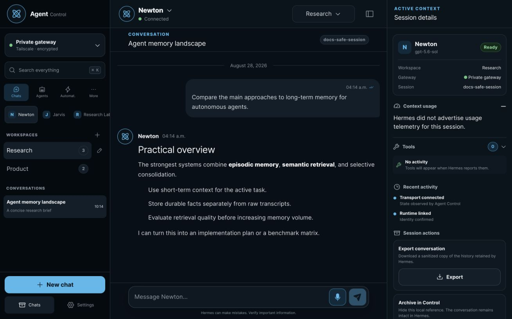
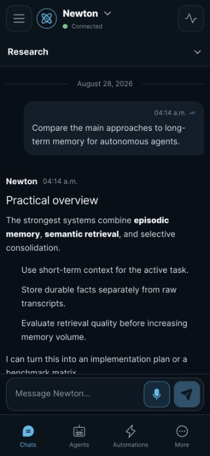
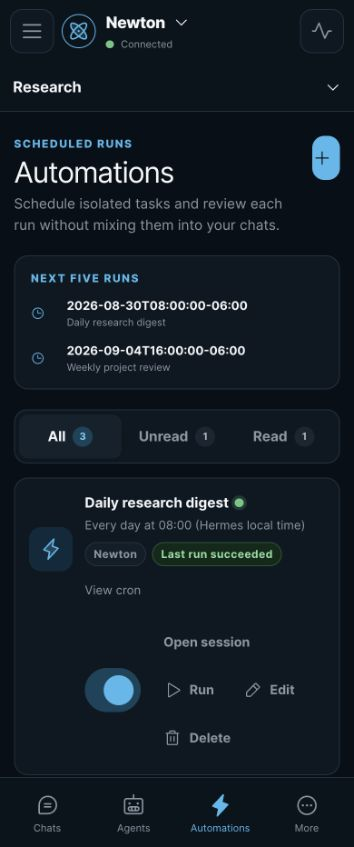
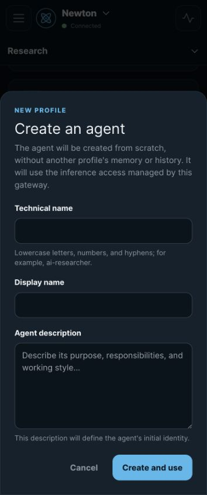

# Agent Control

Agent Control is a mobile-first control plane for existing agent infrastructure.
Hermes is the first supported provider and remains the source of truth for its
profiles, sessions, messages, tools, approvals, voice notes and cron jobs.
Agent Control adds a secure, responsive interface around that infrastructure;
it does not replace or patch the agent runtime. Future providers such as
OpenClaw can use the same backend boundary.

<p align="center">
  
</p>

The browser talks only to Agent Control. Provider URLs, reusable credentials
and API keys stay in the FastAPI backend, while the React PWA uses relative
same-origin APIs and normalized realtime events.

## Highlights

| Area | Available today |
| --- | --- |
| Conversations | Create and resume profile-isolated chats, stream Markdown, stop a run, answer verified approvals and clarifications, recover after disconnects, export or archive a conversation, and play proxied voice notes. |
| Agents | Discover Newton, Jarvis and other provider profiles; use their verified tools and administration capabilities; create a clean isolated Hermes profile while following live setup progress, then start in a new empty chat without opening a terminal or copying the brief directly into SOUL. |
| Automations | Create, edit, pause, resume, run and delete cron jobs on eligible profiles; use simple or advanced schedules; inspect the next five runs; filter results by All, Unread and Read. |
| Voice | Configure one owner-scoped ElevenLabs key for Scribe v2 Realtime dictation and response playback with either Flash v2.5 or Multilingual v2. Choose an account voice and model, listen while an answer streams, or replay any completed response with play/pause, stop and speed controls. Eleven v3 is intentionally excluded; native keyboard dictation remains the free fallback. |
| Organization | Group chats into optional local workspaces, search across the interface and keep an encrypted, bounded offline snapshot when explicitly enabled. |
| Mobile and desktop | Installable PWA, 44 px touch targets, bottom navigation and context sheets on mobile, two panels on tablet, three panels on desktop, and dark/light/automatic themes. |
| Internationalization | English, Spanish, French, German and Portuguese with browser-language detection and an immediate device-only language preference. |
| Operations | Deterministic Hermes mock, supervised SSH tunnels, diagnostics, Docker and systemd assets, backup/restore guidance, and a Tailscale Serve deployment that exposes only Agent Control. |

<table>
  <tr>
    <td width="33%" align="center">
      <br>
      <strong>Conversation-first mobile UI</strong>
    </td>
    <td width="33%" align="center">
      <br>
      <strong>Readable automation inbox</strong>
    </td>
    <td width="33%" align="center">
      <br>
      <strong>Agent creation without a terminal</strong>
    </td>
  </tr>
</table>

## Documentation

- [User guide](docs/user-guide.md): concepts, everyday workflows, mobile use,
  dictation, spoken responses, language settings and troubleshooting.
- [Architecture](docs/architecture.md): trust boundaries, provider adapters,
  session identity, recovery and BYOK dictation.
- [Deployment runbook](docs/operations/deployment.md): systemd, Docker,
  Tailscale Serve and post-deploy checks.
- [Local installers](docs/operations/installers.md): full systemd and per-user
  macOS setup, including dry runs, prerequisites, flags, secrets, and recovery.
- [Development runbook](docs/operations/development.md): mock and remote-tunnel
  workflows.
- [Threat model](docs/threat-model.md), [known limitations](docs/limitations.md)
  and [remote test safety](docs/operations/remote-test-safety.md).

## Local development

Requirements: Node 20+, npm and Python `>=3.12,<3.15`.

```bash
cp .env.example .env
make bootstrap
make migrate
```

Generate a development vault key without committing it:

```bash
python3 -c 'import base64,secrets; print(base64.urlsafe_b64encode(secrets.token_bytes(32)).decode().rstrip("="))'
```

Set that output as `HERMES_CONTROL_VAULT_KEY_B64` in `.env`. Start either the
deterministic mock:

```bash
make mock
```

or the Tailscale-backed SSH tunnel supervisor:

```bash
make tunnels
```

Then start the API and web app in separate terminals:

```bash
make api
make dev
```

The Vite app uses same-origin `/api` and `/realtime` paths through its
development proxy. No Hermes or ElevenLabs secret is needed by the frontend.

Create the first administrator with the backend CLI after the migration:

```bash
.venv/bin/hermes-control-admin create-admin --username admin
```

`make api` also depends on the idempotent Alembic migration target, so every
development API start verifies the schema before serving requests.

## Verification

```bash
make test
make build
```

Remote integration tests are opt-in. The product runtime gives Newton
(`default`), Jarvis (`jarvis`) and `control-dev` their complete verified
capabilities, while automated destructive test mutations remain hard-guarded
to the exact `control-dev` profile. See
[remote test safety](docs/operations/remote-test-safety.md).

## Repository map

- `apps/web`: production React 19 PWA.
- `apps/api`: FastAPI backend and security boundary.
- `apps/mock-hermes`: deterministic Hermes protocol simulator.
- `packages/hermes-client`: typed defensive Hermes clients and session routing.
- `packages/ui`: shared presentation primitives.
- `design/prototypes/mobile-option-2`: selected mobile prototype and visual QA.
- `docs`: user guide, architecture, API matrix, threat model, ADRs and operations.
- `deploy`: Docker and systemd deployment assets.

## Production model

Production keeps Hermes on loopback and exposes only Agent Control through
Tailscale Serve. Agent Control and Hermes run as separate services. This
repository never vendors, patches or replaces Hermes, and never edits its
internals, profiles, state databases or source code directly.

The screenshots above were captured from the production web bundle with a
deterministic local fixture. All names and conversation content shown are
fictional, the capture locale is English, and no credential or private runtime
data is present.
