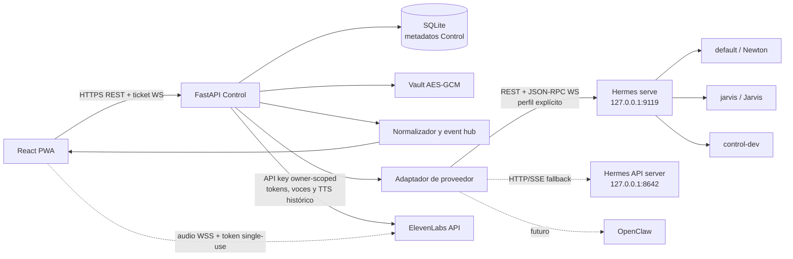
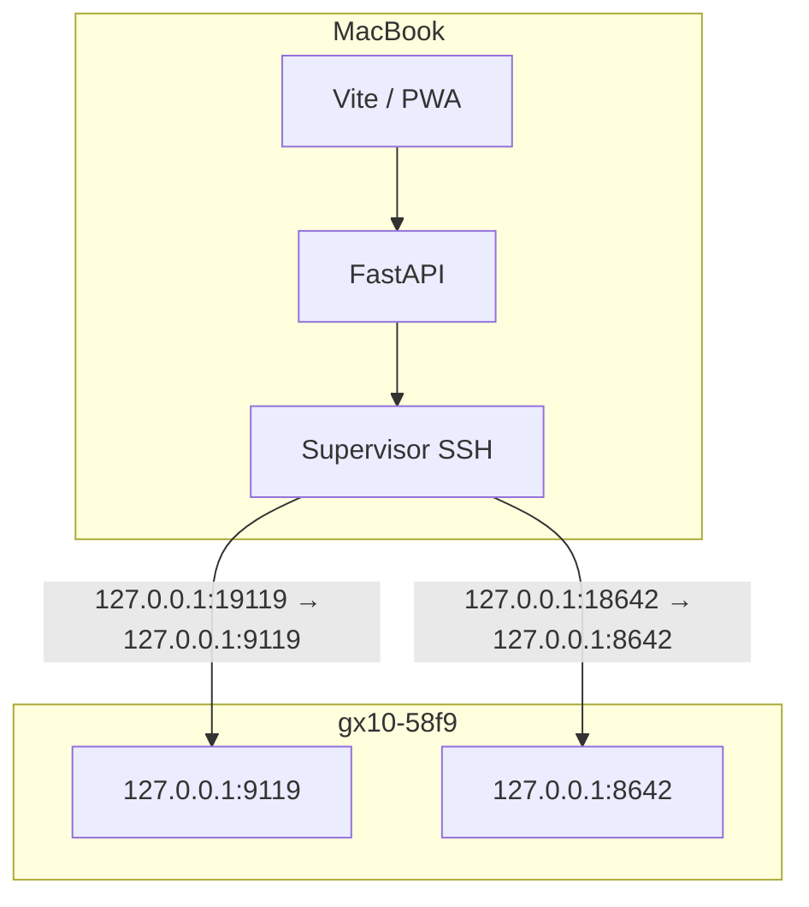
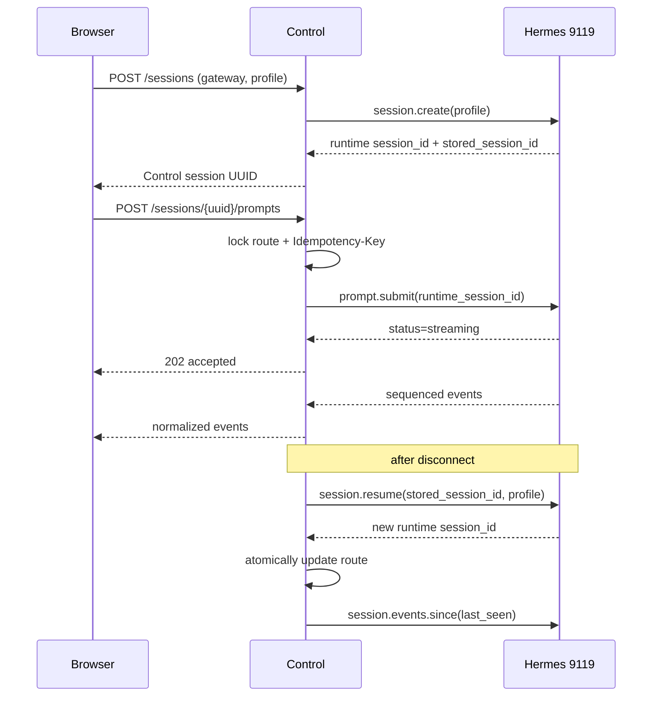

# Arquitectura de Agent Control

## Límites de confianza

Agent Control es el único mediador entre el navegador y los proveedores de
agentes. Hermes es el primer adaptador implementado; OpenClaw podrá añadirse
detrás del mismo límite. El navegador no recibe direcciones, tokens, claves ni
tramas nativas de ningún proveedor de agentes.

El dictado BYOK es una excepción estrecha y separada de ese límite: después de
una acción explícita del usuario, Control puede entregar al navegador un token
de transcripción de un solo uso. El navegador envía audio directamente a
ElevenLabs por el único origen WebSocket permitido. La API key de larga duración
permanece cifrada en el backend y esta integración nunca se vincula a Hermes,
OpenClaw, un gateway, un perfil o una sesión de agente.
La decisión y sus límites están formalizados en
[ADR 0006](adr/0006-owner-scoped-realtime-transcription.md). La misma credencial
puede habilitar TTS bajo el contrato separado de
[ADR 0007](adr/0007-owner-scoped-elevenlabs-tts.md): un token de un solo uso para
audio en vivo y un proxy autenticado para respuestas históricas.



En desarrollo, los dos enlaces de Control hacia Hermes cruzan SSH sobre
Tailscale. En producción, Control y Hermes están en la misma máquina y se
comunican por loopback.



## Componentes

- **Web:** presentación, borradores y caché offline opcional. Las URLs de Control
  y de proveedores de agentes son relativas al origen de Control. La única
  excepción son los WebSockets de dictado y TTS en vivo hacia el origen exacto
  de ElevenLabs, autorizados por CSP y solo después de una acción del usuario.
  Un coordinador de actualización PWA mantiene el nuevo service worker en espera
  hasta una acción explícita; dictado, streaming y borradores bloquean la recarga
  y la selección actual se conserva solo durante ese relevo controlado. La
  reproducción de voz también bloquea una actualización para no cortar audio.
- **API Control:** autenticación, CSRF, autorización, metadatos, auditoría,
  idempotencia, validación SSRF y traducción de protocolos.
- **Adaptadores de proveedor:** traducen las capacidades de cada runtime al
  contrato normalizado de Control sin exponer protocolos nativos al navegador.
- **Cliente Hermes:** una conexión lógica por `(gateway, profile)`, negociación
  de capacidades y conservación de identidad de sesión.
- **Event hub:** transforma eventos Hermes en `NormalizedEvent`, elimina campos
  sensibles, deduplica y entrega solo eventos autorizados al usuario.
- **SQLite:** contiene estado propio de Control; nunca sustituye `state.db` de
  Hermes ni duplica el transcript completo.
- **Mock Hermes:** doble determinista en memoria para desarrollar sin el equipo
  remoto y para ensayar errores no seguros contra agentes reales.
- **Integración de transcripción:** credencial BYOK propia de cada usuario,
  cifrada por Control y usada únicamente para solicitar tokens de un solo uso.
  No es un adaptador de agente y no participa en el routing de sesiones.
- **Integración de voz:** reutiliza la misma credencial cifrada, conserva solo
  el ID/nombre no secretos de la voz elegida y el modelo permitido (Flash v2.5
  o Multilingual v2), y nunca asocia el audio a Hermes. Eleven v3 no forma parte
  del contrato público.

## Dictado BYOK

```mermaid
sequenceDiagram
    participant UI as Browser/PWA
    participant C as Control
    participant EL as ElevenLabs
    UI->>C: POST /api/v1/realtime/transcription-token
    Note over UI,C: cookie + Origin + CSRF; rate limit; no Idempotency-Key
    C->>C: decrypt owner-scoped API key in memory
    C->>EL: request single-use Scribe token
    EL-->>C: token
    C-->>UI: token + expiresAt + modelId (Cache-Control: no-store)
    UI->>EL: WSS /v1/speech-to-text/realtime?token=<single-use>
    UI-->>EL: microphone audio
    EL-->>UI: partial/committed transcript events
    UI->>UI: preview partial text inside the composer (ephemeral)
    UI->>UI: replace preview with committed unsent draft text
```

El token vive solo en memoria, no entra en SQLite, IndexedDB, `localStorage`,
logs, auditoría, caché del service worker ni el ledger de idempotencia. El
protocolo oficial lo transporta inevitablemente como query del WSS; Control no
registra ni persiste esa URL completa y cualquier diagnóstico o telemetría del
navegador debe omitirla o redactarla. Cada captura necesita un token nuevo; no se
reusa para reconectar. La PWA cierra el flujo al detener, navegar, ocultar la
aplicación, cerrar sesión o fallar el permiso del micrófono.

El audio viaja del dispositivo a ElevenLabs y no atraviesa Control. Antes de
activar el micrófono la interfaz informa este destino y que la retención se rige
por la cuenta y las condiciones de ElevenLabs; Control no promete retención
cero. El texto provisional se presenta directamente dentro del compositor, no
se persiste y mantiene el editor protegido frente a cambios manuales mientras
la captura está activa. Solo el texto confirmado sustituye esa vista, se
incorpora al borrador editable y nunca se envía automáticamente al agente. El
compositor parte de un renglón, crece hasta seis y después desplaza su contenido.
El dictado nativo del teclado del sistema operativo permanece como alternativa
cuando BYOK, el navegador o la red no están disponibles.

## Lectura de respuestas

Para una respuesta en curso, Control acuña un token `tts_websocket` y el
navegador abre el WebSocket oficial con la voz verificada. El texto incremental
saneado entra por ese canal y los fragmentos MP3 se anexan a un `MediaSource`;
la API key reutilizable nunca llega al cliente. Para una respuesta histórica,
el navegador envía el texto visible a un endpoint Control autenticado y con
CSRF; FastAPI solicita el stream HTTP oficial y lo retransmite como
`audio/mpeg`, `no-store`. Código en bloque, URLs y rutas `MEDIA:` se omiten de la
forma hablada. Ningún texto o audio TTS se guarda en SQLite, auditoría,
idempotencia o la caché offline.

El cliente Scribe fijado en el lockfile se endurece mediante el patch reproducible
versionado bajo `patches/`, aplicado por `patch-package` en `npm install`. Antes de
parsear eventos, rechaza mensajes de texto mayores de 65,536 unidades UTF-16 de
JavaScript; este es un límite textual después de recibir el frame, no un límite
de bytes en la red. Tampoco imprime payloads, motivos de cierre ni errores crudos
a la consola. Los eventos parciales existen solo en presentación: únicamente
`COMMITTED_TRANSCRIPT` puede editar el borrador.

## Identidad y reanudación



`stored_session_id` is durable and `runtime_session_id` is process-local. Every
command resolves the stored Control UUID to an immutable gateway/profile/stored
tuple. A resume may replace the runtime ID; no request may reuse the old one.

## Reconnect contract

1. Send heartbeat every 15 seconds and declare the socket stale after 45.
2. Reconnect with exponential backoff and jitter, capped at 30 seconds.
3. Compare `replay_epoch` from `gateway.ready`; reset watermarks on change.
4. Request `session.events.since` for each attached runtime session.
5. Deduplicate by `(route, epoch, seq)`.
6. If `truncated=true`, discard the partial optimistic view and rehydrate the
   durable transcript.
7. If a disconnect happens after `prompt.submit` was accepted, reconcile the
   durable last user turn. Never resend the prompt automatically.

Connection-state persistence is best-effort for the transport supervisor: a
temporary SQLite failure is logged without values and retried while the
reconnector stays alive. `control.connection` updates only its known
`(gateway, profile)` observation without requiring any session link; the
gateway cache is then aggregated across every required profile, never by the
last event to arrive. Readiness expires that cache after the
configured TTL, so an old `online` value never becomes an indefinite claim
about Hermes. Gateway APIs, bootstrap and the diagnostic hero use that same
TTL-aware projection, so no screen can remain “connected” after readiness has
declared the observation stale. The independent automation-route watcher likewise exposes
`healthy`, `failed` or `stale` state and retries after database/table failures.

## Ownership de datos

See [data model](data-model.md) for the logical schema. Hermes owns messages,
profiles, runtime state and cron execution transcripts. Control owns users,
authentication, gateway configuration, encrypted credentials, owner-scoped
transcription integrations, workspaces, routing references, local presentation
metadata, audit and idempotency state. Single-use transcription tokens and
microphone audio are deliberately excluded from persistent Control state.
