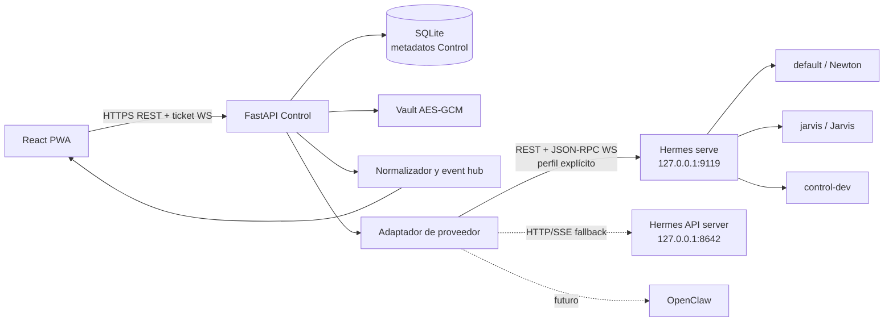
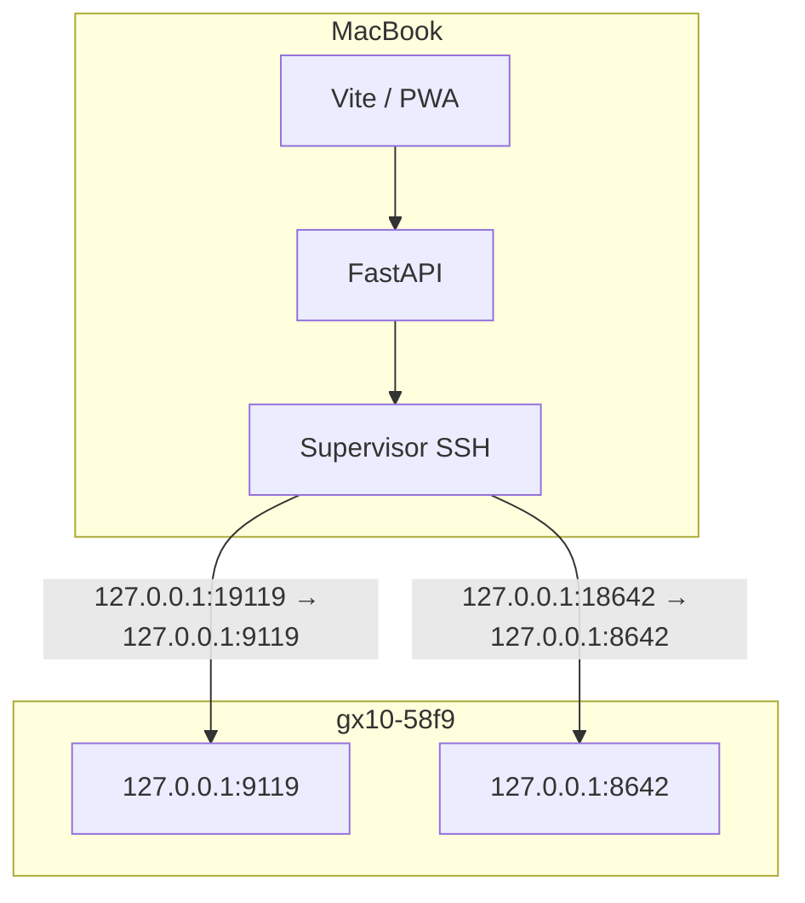
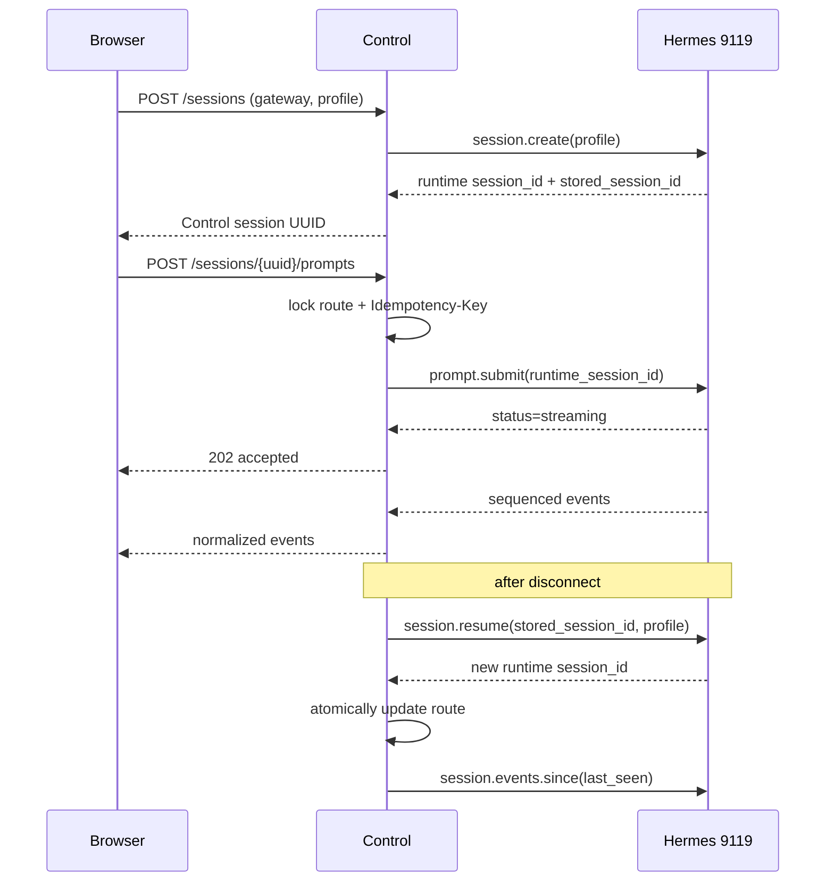

# Arquitectura de Agent Control

## Límites de confianza

Agent Control es el único mediador entre el navegador y los proveedores de
agentes. Hermes es el primer adaptador implementado; OpenClaw podrá añadirse
detrás del mismo límite. El navegador no recibe direcciones, tokens, claves ni
tramas nativas de ningún proveedor.

En desarrollo, los dos enlaces de Control hacia Hermes cruzan SSH sobre
Tailscale. En producción, Control y Hermes están en la misma máquina y se
comunican por loopback.

## Componentes

- **Web:** presentación, borradores y caché offline opcional. Todas sus URLs de
  datos son relativas al origen de Control.
- **API Control:** autenticación, CSRF, autorización, metadatos, auditoría,
  idempotencia, validación SSRF y traducción de protocolos.
- **Adaptadores de proveedor:** traducen las capacidades de cada runtime al
  contrato normalizado de Control sin exponer protocolos nativos al navegador.
- **Cliente Hermes:** una conexión lógica por `(gateway, profile)`, negociación
  de capacidades y conservación de identidad de sesión.
- **Event hub:** transforma eventos Hermes en `NormalizedEvent`, elimina campos
  sensibles, deduplica y entrega solo eventos autorizados al usuario.
- **SQLite:** contiene estado propio de Control; nunca sustituye `state.db` de
  Hermes ni duplica el transcript completo.
- **Mock Hermes:** doble determinista en memoria para desarrollar sin el equipo
  remoto y para ensayar errores no seguros contra agentes reales.

## Identidad y reanudación

`stored_session_id` is durable and `runtime_session_id` is process-local. Every
command resolves the stored Control UUID to an immutable gateway/profile/stored
tuple. A resume may replace the runtime ID; no request may reuse the old one.

## Reconnect contract

1. Send heartbeat every 15 seconds and declare the socket stale after 45.
2. Reconnect with exponential backoff and jitter, capped at 30 seconds.
3. Compare `replay_epoch` from `gateway.ready`; reset watermarks on change.
4. Request `session.events.since` for each attached runtime session.
5. Deduplicate by `(route, epoch, seq)`.
6. If `truncated=true`, discard the partial optimistic view and rehydrate the
   durable transcript.
7. If a disconnect happens after `prompt.submit` was accepted, reconcile the
   durable last user turn. Never resend the prompt automatically.

Connection-state persistence is best-effort for the transport supervisor: a
temporary SQLite failure is logged without values and retried while the
reconnector stays alive. `control.connection` updates only its known
`(gateway, profile)` observation without requiring any session link; the
gateway cache is then aggregated across every required profile, never by the
last event to arrive. Readiness expires that cache after the
configured TTL, so an old `online` value never becomes an indefinite claim
about Hermes. Gateway APIs, bootstrap and the diagnostic hero use that same
TTL-aware projection, so no screen can remain “connected” after readiness has
declared the observation stale. The independent automation-route watcher likewise exposes
`healthy`, `failed` or `stale` state and retries after database/table failures.

## Ownership de datos

See [data model](data-model.md) for the logical schema. Hermes owns messages,
profiles, runtime state and cron execution transcripts. Control owns users,
authentication, gateway configuration, encrypted credentials, workspaces,
routing references, local presentation metadata, audit and idempotency state.
