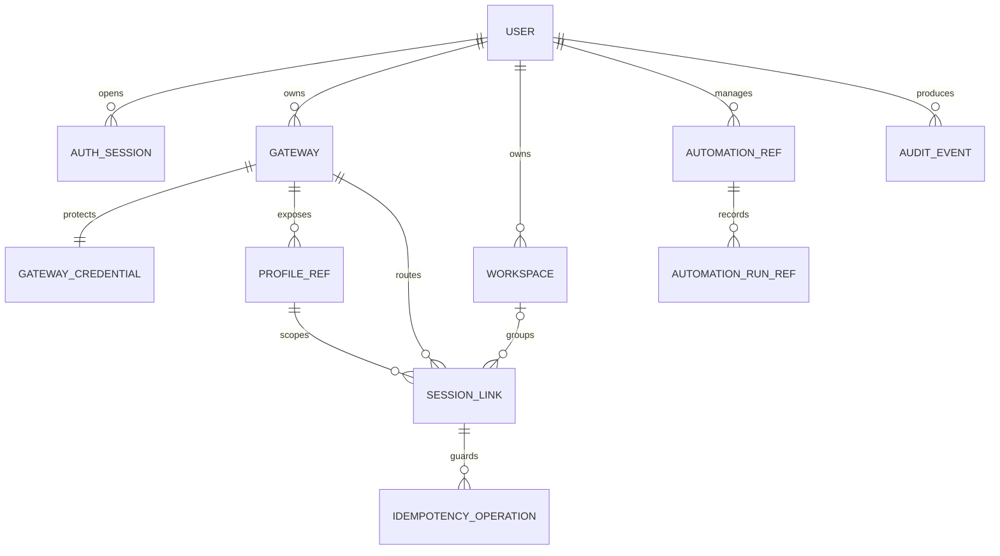

# Modelo lógico de datos

## Invariantes

- Internal primary keys are UUIDs; Hermes identifiers are opaque strings.
- `SESSION_LINK` has immutable `gateway_id`, `profile_name` and
  `stored_session_id`, plus a nullable replaceable `runtime_session_id`.
- `(gateway_id, profile_name, stored_session_id)` is unique.
- A session belongs to zero or one workspace. Moving it is an audited local
  metadata operation and never edits Hermes internals.
- Gateway credentials are separate AES-GCM records with random nonces and AAD
  containing gateway ID plus field name. Read APIs return presence only.
- `PROFILE_REF.last_seen_at` records route connectivity, while
  `capabilities_checked_at` independently bounds capability trust. Heartbeats
  can never prolong a capability assertion. Gateway health is a fail-closed
  aggregate of all configured/discovered profile observations: mixed or stale
  membership is degraded/unknown rather than last-writer-wins.
- `IDEMPOTENCY_OPERATION` records request hash, status and response reference;
  the same key with different input is rejected.
- Messages remain in Hermes. Control may store only drafts, safe display
  metadata, compact search projections and the explicitly enabled encrypted
  offline snapshot.
- Cron jobs/runs are references to Hermes objects. A cron run's session is not
  inserted into the ordinary chat list unless the user explicitly opens it.

## Retención

- Auth sessions: expire and purge after their configured idle/absolute limits.
- Audit events: 90 days by default, configurable before production rollout.
- Completed idempotency records: 24 hours unless an operation is still being
  reconciled.
- Offline browser snapshot: opt-in, seven days, 200 items or 10 MB maximum,
  cleared at logout; attachments are excluded.
