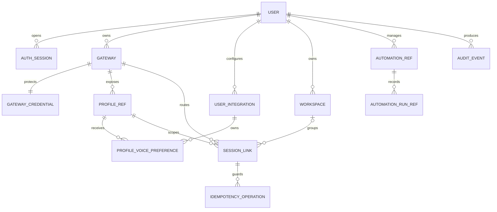

# Modelo lógico de datos

## Invariantes

- Internal primary keys are UUIDs; Hermes identifiers are opaque strings.
- `SESSION_LINK` has immutable `gateway_id`, `profile_name` and
  `stored_session_id`, plus a nullable replaceable `runtime_session_id`.
- `(gateway_id, profile_name, stored_session_id)` is unique.
- A session belongs to zero or one workspace. Moving it is an audited local
  metadata operation and never edits Hermes internals.
- `SESSION_LINK.title` is the canonical value last reported by Hermes;
  `display_title` is an optional owner label used by Agent Control navigation
  and search. Renaming never edits the provider conversation or its history.
- Gateway credentials are separate AES-GCM records with random nonces and AAD
  containing gateway ID plus field name. Read APIs return presence only.
- `USER_INTEGRATION` is unique by `(owner_id, provider)`. For ElevenLabs it
  stores the encrypted API key plus the non-secret default voice and TTS model;
  the model is constrained to Flash v2.5 or Multilingual v2. AAD binds owner ID,
  provider and field name so ciphertext cannot be moved between users or uses.
  Reads expose `configured`, provider and model metadata, never the key.
- `PROFILE_VOICE_PREFERENCE` optionally overrides that default for one exact
  `(user integration, profile reference)` pair. Because `PROFILE_REF` already
  identifies both gateway and technical profile name, homonymous agents on
  different computers never share a voice. Deleting or replacing an integration
  credential removes its overrides so voice IDs from another ElevenLabs account
  cannot be reused accidentally.
- A transcription integration is independent from `GATEWAY`, `PROFILE_REF`,
  `SESSION_LINK` and every Hermes/OpenClaw object. The optional language hint
  affects only the subsequent browser/provider handshake.
- Single-use transcription tokens are not rows or durable metadata. They are
  excluded from idempotency response storage, audit payloads, offline snapshots
  and browser persistence. Control stores neither microphone audio nor the
  provider's partial transcript events.
- `PROFILE_REF.last_seen_at` records route connectivity, while
  `capabilities_checked_at` independently bounds capability trust. Heartbeats
  can never prolong a capability assertion. Gateway health is a fail-closed
  aggregate of all configured/discovered profile observations: mixed or stale
  membership is degraded/unknown rather than last-writer-wins.
- `PROFILE_REF.managed_by_control` durably marks profiles created through the
  UI. Their local display name and description survive upstream discovery, and
  the marker rebuilds their audited mutation grant after a Control restart.
  Hermes remains authoritative for the actual profile, model, SOUL, skills and
  conversations.
- `IDEMPOTENCY_OPERATION` records request hash, status and response reference;
  the same key with different input is rejected.
- Messages remain in Hermes. Control may store only drafts, safe display
  metadata, compact search projections and the explicitly enabled encrypted
  offline snapshot.
- Cron jobs/runs are references to Hermes objects. A cron run's session is not
  inserted into the ordinary chat list unless the user explicitly opens it.

## Retención

- Auth sessions: expire and purge after their configured idle/absolute limits.
- Audit events: 90 days by default, configurable before production rollout.
- Completed idempotency records: 24 hours unless an operation is still being
  reconciled.
- Offline browser snapshot: opt-in, seven days, 200 items or 10 MB maximum,
  cleared at logout; attachments are excluded.
- Owner-scoped integration credentials: retained until that owner replaces or
  deletes them. Database backups contain only ciphertext and require the
  separately held vault key for recovery.
- Transcription tokens and microphone audio: no Control retention. Provider
  processing and retention follow the owner's ElevenLabs account and terms.
