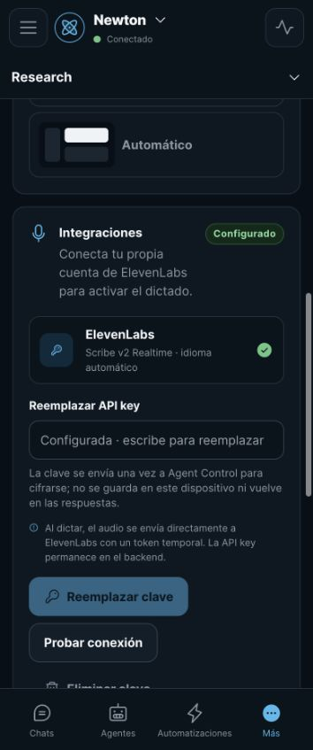
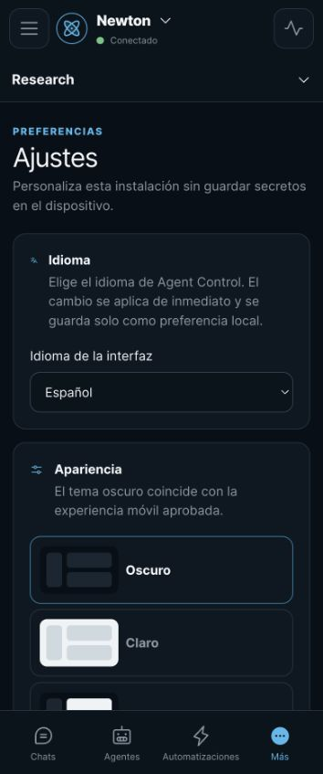

# Agent Control user guide

Agent Control is an installable web interface for agent infrastructure that is
already running. Hermes is the first supported provider. Agent Control does not
replace Hermes, move its memory into SQLite or modify its internal files. It
keeps browser-facing authentication, organization and presentation state on one
side of a backend security boundary and talks to the provider on the other.
OpenClaw is a planned provider adapter, not a currently supported runtime.

<p align="center">
  
</p>

## Access and identities

The Agent Control login is an application account. It is separate from the
Linux account that runs the service, from an SSH identity and from every agent
profile. For example, creating an Agent Control administrator named `juan` does
not create or require a Linux administrator named `juan`, and that user does
not need `sudo` merely to sign in and chat. The initial release supports one
application administrator.

## Understand the three main concepts

### Gateway

A gateway is a connection to one agent installation. For example, **Private
gateway** may point to a remote Hermes instance through a private tunnel. The
gateway name describes the infrastructure connection; it does not change when
you switch from Newton to Jarvis because both profiles can live behind the same
gateway.

### Agent

An agent is a provider profile with its own configuration, memory, sessions and
tool policy. In the original Hermes deployment:

- technical profile `default` is presented as **Newton**;
- technical profile `jarvis` is presented as **Jarvis**;
- `control-dev` is the isolated development profile used for mutable automated
  integration tests.

The friendly name shown by Agent Control never changes the technical profile
identifier used for routing.

### Workspace

A workspace is an optional Agent Control folder for related conversations, such
as “Research”, “Product” or “Personal”. It is local metadata: it does not create
a provider profile, merge agent memories or change the tools available to an
agent. Every conversation can belong to zero or one workspace and can be moved
later.

## Conversations

Open **Chats**, select an agent, choose a workspace if desired and press **New
chat**. The same action is also present in the empty conversation state so a
mobile user never has to discover it in another menu.

<p align="center">
  
</p>

During a conversation Agent Control can:

- stream normalized Markdown without exposing raw provider frames;
- stop an active run and show delivery or reconciliation status;
- render verified approval and clarification requests as explicit controls;
- reconnect after a tunnel, Tailscale or provider interruption without
  automatically resending an ambiguous prompt;
- keep drafts on the device and optionally cache a bounded encrypted snapshot;
- show context use, tools, subagents and recent activity in the pulse panel or
  mobile context sheet;
- open the three-dot menu beside any conversation to give it a local friendly
  name or begin a permanent deletion;
- export a sanitized conversation, archive it normally, or perform a separately
  confirmed provider deletion when the capability is verified.

Renaming and moving a chat between workspaces change only the organization
shown and searched by Agent Control. The three-dot conversation menu can move a
chat to any workspace or back to **No workspace**. Hermes keeps its canonical
session title and history untouched. Permanent deletion is
shown only when the provider contract confirms `session.delete`; a dedicated
warning names the conversation and requires a separate destructive
confirmation. Agent Control still supplies the exact persistent session ID
internally so the backend cannot delete a different conversation.

The empty composer starts at one line, grows line by line up to six visible
lines, and then scrolls. Tool execution detail is kept in the activity panel so
it does not consume vertical space after every assistant response.

### Voice notes from an agent

When an agent response contains a supported `MEDIA:` audio reference, Agent
Control displays a native audio player. The browser receives a session-bound
Control URL; it never receives the provider host path. The backend validates
the reference against the authorized conversation and streams it inline with
safe headers.

## Dictation with your own ElevenLabs key

Agent Control supports BYOK (bring your own key) dictation with ElevenLabs
Scribe v2 Realtime:

1. Open **More → Settings → Integrations**.
2. Add your ElevenLabs API key and test the connection.
3. Return to a writable chat. The microphone appears only when the integration,
   browser and current session support it.
4. Review the destination and retention notice, allow microphone access and
   start speaking.
5. Stop dictation, edit the committed text if needed, and press Send yourself.

<p align="center">
  
</p>

Provisional text is previewed directly inside the composer so the entire phrase
remains visible. It is ephemeral, is not saved as a draft and cannot be sent.
The editor remains protected from manual changes while provisional text is
active. A committed transcript replaces the preview, becomes ordinary editable
draft text and is still never submitted automatically.

The reusable API key is sent once to Agent Control, encrypted with the external
vault key and treated as write-only. It is not stored in IndexedDB,
`localStorage`, a `VITE_*` variable, frontend JavaScript or read responses.
Control uses it only to mint a short-lived single-use token. Microphone audio
then travels directly from the device to ElevenLabs over WSS. Capture closes on
stop, navigation, backgrounding, logout or failure; a later capture mints a new
token.

If no ElevenLabs key is configured, the app hides its own microphone control.
The dictation button in the phone's native keyboard remains the no-cost
fallback and does not require an Agent Control integration.

## Listen to agent responses with ElevenLabs

The same write-only ElevenLabs key can synthesize agent responses:

1. Open **More → Settings → Integrations**, choose **Flash v2.5** for the
   lowest latency or **Multilingual v2** for more natural, stable long-form
   speech, and choose a voice from the catalog available to your ElevenLabs
   account. Agent Control intentionally does not offer Eleven v3. Press
   **Try voice** to play the
   provider's sample before saving it; the preview can be paused and resumed
   and does not change the active voice.
2. In a chat, enable **Listen to responses live** to hear new answers while the
   agent is still generating them. This preference is local to the device and
   defaults to off.
3. To hear an older answer, press the speaker below that answer. The inline
   player provides play/pause, stop and 0.75×–2× speed controls.

The selected model applies to both live and historical playback. Live reading
uses the provider's TTS WebSocket and a fresh, short-lived,
single-use `tts_websocket` token. Agent Control sends incremental answer text;
audio chunks return directly to the PWA and begin playing as they arrive.
Historical playback sends the selected answer to an authenticated Control
endpoint, which streams the resulting MP3 without disclosing the reusable key.
Only visible assistant text is synthesized: code blocks, URLs and private
`MEDIA:` paths are removed from the spoken form.

Changing the API key clears the selected voice because the replacement key may
belong to another ElevenLabs workspace. Select a voice again to re-enable
playback. Audio synthesis consumes the quota and follows the retention settings
of the owner's ElevenLabs account. Catalog previews reuse ElevenLabs' existing
sample audio instead of synthesizing new text, so testing a voice does not spend
TTS characters.

## Agents

The **Agents** screen lists profiles discovered through the selected gateway.
Newton and Jarvis are not limited to read-only use: Agent Control exposes the
complete contract that the backend has verified for their provider version,
trusted source SHA and operator policy. Unsupported or unverified controls stay
hidden rather than failing optimistically.

### Create an agent without a terminal

Use **Create agent** at the bottom of the Agents screen. Provide:

- a technical profile name used for routing (the form normalizes capitals,
  spaces and underscores to lowercase hyphens);
- a friendly display name;
- a plain-language setup brief describing the agent's role, rules and behavior.
  Long prompts are supported up to a broad transport-safety boundary.

<p align="center">
  
</p>

The backend first asks the provider to create a fresh isolated profile without
sending the brief as `description` or `soul`. Agent Control then shows a guided
progress screen while it opens an internal setup session and submits the brief
with bounded safety instructions. Hermes analyzes the request and decides what
identity, working rules and configuration to persist; Agent Control never
copies the text directly into `SOUL.md`. If Hermes requests approval or
clarification, the progress screen presents the verified response controls.

After Hermes confirms completion, Agent Control archives the internal setup
session, activates the new profile and creates a second, empty conversation.
The app only then navigates to **Chats**, so the operator starts with the new
agent active and a clean composer instead of seeing the technical setup brief.
If transport becomes ambiguous, retry resumes checking the same operation and
does not automatically resend the brief.

New profiles start with empty memory and history and use the gateway-managed
inference authentication pool. A Telegram bot or channel is not created
automatically; channel setup remains a separate provider administration task.

## Configuration and agent functions

Open **More → Configuration** to manage the selected profile through its
verified provider contract. Depending on what that profile announces, the
interface can expose models, compatible configuration, SOUL, skills, toolsets,
MCP servers, channels, usage/context and write-only secrets. Tool calls,
approval requests, clarification questions and subagent activity remain tied to
the conversation that produced them.

These controls are a view over the existing provider infrastructure. Agent
Control never edits Hermes files or databases directly, and it does not pretend
that a feature exists based only on a version number. Capability discovery,
trusted source verification and operator policy must all agree. The audited
Hermes 0.20.5/0.20.6 memory endpoints are not profile-aware, so memory editing
stays hidden for real providers rather than risking a cross-profile change.

## Automations

Automations are provider cron jobs whose runs remain isolated from ordinary
chat history. Eligible profiles can create, edit, pause, resume, run and delete
jobs. The editor supports a guided schedule, an advanced cron expression,
human-readable explanation, templates and the next five projected runs. It
also lets you choose a workspace; new automations default to the workspace
currently selected in Agent Control, and their future execution sessions are
organized there as well.

<p align="center">
  
</p>

The automation inbox has three filters:

- **All** shows every discovered job;
- **Unread** shows jobs whose latest result has not been opened;
- **Read** shows jobs whose latest result has already been reviewed.

A green dot marks an unread latest result. Opening its execution session marks
that result as read. Background synchronization refreshes automation metadata
without navigating away from the result a user is reading.

The schedule uses the profile's configured timezone or, when absent, the
provider host timezone. Hermes 0.20.5/0.20.6 does not provide a different
timezone for each individual job.

## Languages, appearance and offline preferences

Open **More → Settings** to choose English, Spanish, French, German or
Portuguese. Browser language is used on first launch; an explicit choice takes
effect immediately and is stored only as a device preference. Interface copy is
translated, but provider-generated messages and user content are not sent to a
translation service.

<p align="center">
  
</p>

The same screen offers dark, light and automatic appearance. The optional
encrypted offline snapshot is limited to the latest workspace, 200 items,
10 MB and seven days, and excludes attachments. The service worker caches the
application shell, not API responses, and Background Sync never resends
messages. **Clear local data** removes device-side preferences, drafts and
cached presentation data without deleting provider conversations.

The installed PWA checks for a new Agent Control release when it opens, when it
returns to the foreground and periodically while it remains active. A cyan dot
on the activity button announces an available release; open that panel and use
**Update now**. **More → Settings → App updates** also shows the installed
version and provides **Check for updates**.

Agent Control never reloads in the middle of voice dictation, a streaming agent
response or an unsent draft. In that case the action becomes **Update when
finished** and activation waits for a safe moment. The selected gateway,
workspace, agent and conversation are restored after the controlled reload;
drafts remain in the existing encrypted/local draft store.

If Android cannot start the JavaScript bundle after an interrupted PWA update,
the startup screen changes from **Starting Agent Control…** to a localized
**Repair and reload** action. It unregisters the stale service worker and clears
only Cache Storage before downloading a fresh shell. IndexedDB preferences,
drafts and encrypted offline data are deliberately preserved.

## Mobile installation with Tailscale Serve

The recommended private mobile deployment keeps Hermes and Agent Control's
upstream ports on loopback and publishes only Agent Control:

```text
Phone browser/PWA
    → HTTPS Tailscale Serve URL
        → Agent Control 127.0.0.1:8000
            → Hermes 127.0.0.1:9119 (and optional 8642 fallback)
```

1. Install Tailscale on the phone and join the same tailnet as the server.
2. Open the HTTPS Tailscale Serve address shown by the operator.
3. Sign in with the Agent Control account created for this installation.
4. Use the browser's **Install app** or **Add to Home screen** action.

No SSH client or local tunnel is required on the phone. Tailscale authenticates
the device/network path; Agent Control authentication still protects the app.
Ports `9119`, `8642` and `8000` remain unexposed to the public Internet.

## Gateways, search and diagnostics

**More → Gateways** lists private provider connections, health, latency,
version and verified capability count without returning stored credentials.
Additional gateways can be added with write-only URLs, tokens, fallback API
keys and an independently audited source SHA. Diagnostics exports a sanitized
report containing health, compatibility and replay information but no secret.

**Global search** queries provider history and Agent Control metadata across
messages, sessions, workspaces and automations. A partial-results state makes it
clear when one gateway cannot answer. Security and operations views summarize
the encrypted vault, audit events and backup/restore status.

## Security model in everyday use

- Provider URLs, tokens, vault keys and ElevenLabs API keys stay out of served
  frontend assets and browser persistence.
- Login uses an Argon2id password hash and a Secure, HttpOnly, SameSite cookie;
  state changes also require Origin/CSRF checks and an idempotency key.
- Gateway and integration credentials are encrypted with AES-GCM under an
  external master key and read responses expose only configuration presence.
- Realtime browser connections use short-lived one-use tickets and receive
  normalized, sanitized events instead of raw provider RPC.
- Agent Control never displays private chain-of-thought. It can show safe
  status, tool execution and the final response.
- Remote automated mutations are hard-guarded to `control-dev`, even though the
  normal product interface can expose verified Newton and Jarvis capabilities.

For the complete boundary and operational assumptions, read the
[architecture](architecture.md), [threat model](threat-model.md),
[limitations](limitations.md) and [deployment runbook](operations/deployment.md).

## Troubleshooting

- **The gateway is degraded:** confirm Tailscale connectivity or the SSH tunnel,
  then wait for automatic heartbeat/reconnection. Drafts remain available.
- **A profile looks read-only:** open diagnostics and verify the provider
  version, trusted SHA, advertised capability and mutable-profile policy. UI
  availability is based on the complete verified contract, not the version
  label alone.
- **The microphone is missing:** configure and test ElevenLabs, use HTTPS, grant
  microphone permission and open a writable chat. Native keyboard dictation is
  always the fallback.
- **Cron is unavailable:** ensure the selected profile advertises cron and is
  allowed to mutate. A cron created elsewhere can still be listed even when the
  current contract cannot safely edit it.
- **A voice note does not play:** confirm the message belongs to the selected
  session and that the file still exists under the provider's permitted media
  root; host paths are intentionally never returned to the browser.

## Screenshot provenance

Documentation screenshots use the production React bundle with a deterministic
local fixture. They are captured in English with fictional gateways, agents,
workspaces and messages. They contain no credentials, personal conversations or
private provider data.
